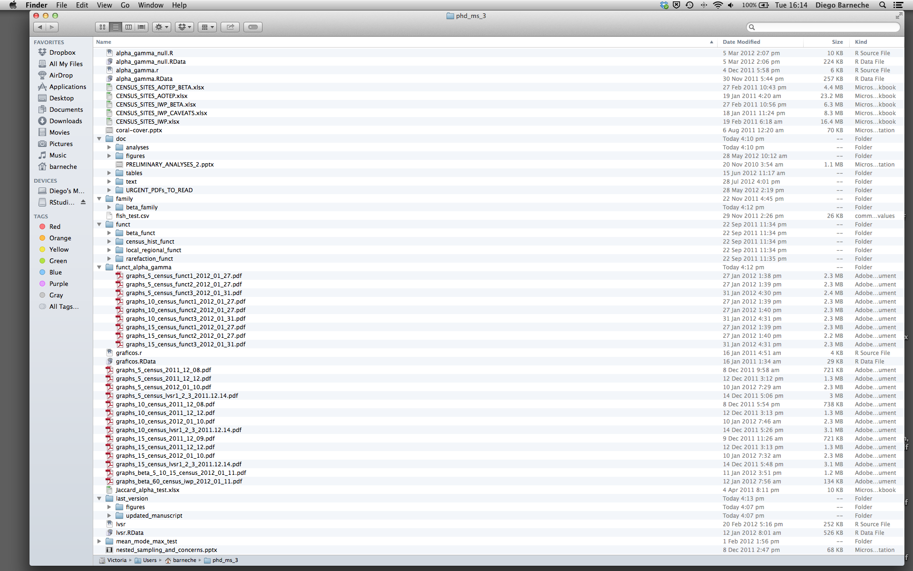

## Introduction

The scientific process is naturally incremental, and many projects
start life as random notes, some code, then a manuscript, and
eventually everything is a bit mixed together.

<blockquote class="twitter-tweet">
Managing your projects in a reproducible fashion doesn't just make your science reproducible, it makes your life easier.
— Vince Buffalo (@vsbuffalo) <a href="https://twitter.com/vsbuffalo/status/323638476153167872">April 15, 2013</a></blockquote>

Most people tend to organize their projects like this:

There are many reasons why we should *ALWAYS* avoid this:

1. It is really hard to tell which version of your data is
the original and which is the modified;
2. It gets really messy because it mixes files with various
extensions together;
3. It probably takes you a lot of time to actually find
things, and relate the correct figures to the exact code
that has been used to generate it;

A good project layout will ultimately make your life easier:

* It will help ensure the integrity of your data;
* It makes it simpler to share your code with someone else
(a lab-mate, collaborator, or supervisor);
* It allows you to easily upload your code with your manuscript submission;
* It makes it easier to pick the project back up after a break.

## A possible solution

Fortunately, there are tools and packages which can help you manage your work effectively.

One of the most powerful and useful aspects of RStudio is its project management
functionality. We'll be using this today to create a self-contained, reproducible
project.

> ## Challenge: Creating a self-contained project
>
> We're going to create a new project in RStudio:
>
> 1. Click the "File" menu button, then "New Project".
> 2. Click "New Directory".
> 3. Click "Empty Project".
> 4. Type in the name of the directory to store your project, e.g. "Intro2R".
> 5. Make sure that the checkbox for "Create a git repository" is selected.
> 6. Click the "Create Project" button.
{: .challenge}

Now when we start R in this project directory, or open this project with RStudio,
all of our work on this project will be entirely self-contained in this directory.

## Best practices for project organization

Although there is no "best" way to lay out a project, there are some general
principles to adhere to that will make project management easier:

### Treat data as read only

This is probably the most important goal of setting up a project. Data is
typically time consuming and/or expensive to collect. Working with them
interactively (e.g., in Excel) where they can be modified means you are never
sure of where the data came from, or how it has been modified since collection.
It is therefore a good idea to treat your data as "read-only".

### Data Cleaning

In many cases your data will be "dirty": it will need significant preprocessing
to get into a format R (or any other programming language) will find useful. This
task is sometimes called "data munging". I find it useful to store these scripts
in a separate folder, and create a second "read-only" data folder to hold the
"cleaned" data sets.

### Treat generated output as disposable

Anything generated by your scripts should be treated as disposable: it should
all be able to be regenerated from your scripts.

There are lots of different ways to manage this output. I find it useful to
have an output folder with different sub-directories for each separate
analysis. This makes it easier later, as many of my analyses are exploratory
and don't end up being used in the final project, and some of the analyses
get shared between projects.

> ## Tip: Good Enough Practices for Scientific Computing
>
> [Good Enough Practices for Scientific Computing](https://github.com/swcarpentry/good-enough-practices-in-scientific-computing/blob/gh-pages/good-enough-practices-for-scientific-computing.pdf) gives the following recommendations for project organization:
>
> 1. Put each project in its own directory, which is named after the project.
> 2. Put raw data and metadata in the `data` directory, and files generated during cleanup and analysis in a `results` directory.
> 3. Put source for the project's scripts and programs in the `scripts` directory, and programs brought in from elsewhere or compiled locally in the `bin` directory.
> 4. Put generated reports (such as Knitr reports, which will be discussed later) in the `reports` directory.
> 5. Name all files to reflect their content or function.
>
{: .callout}

### Separate function definition and application

The most effective way I find to work in R, is to play around in the interactive
session, then copy commands across to a script file when I'm sure they work and
do what I want. You can also save all the commands you've entered using the
`history` command, but I don't find it useful because when I'm typing its 90%
trial and error.

When your project is new and shiny, the script file usually contains many lines
of directly executed code. As it matures, reusable chunks get pulled into their
own functions. It's a good idea to separate these into separate folders; one
to store useful functions that you'll reuse across analyses and projects, and
one to store the analysis scripts.
