Plotting our data is one of the best ways to
quickly explore it and the various relationships
between variables.

There are three main plotting systems in R,
the [base plotting system][base], the [lattice][lattice]
package, and the [ggplot2][ggplot2] package.

[base]: http://www.statmethods.net/graphs/
[lattice]: http://www.statmethods.net/advgraphs/trellis.html
[ggplot2]: http://www.statmethods.net/advgraphs/ggplot2.html

Today we'll be learning about the ggplot2 package, because
it is the most effective for creating publication quality
graphics.

ggplot2 is built on the grammar of graphics, the idea that any plot can be
expressed from the same set of components: a **data** set, a
**coordinate system**, and a set of **geoms**--the visual representation of data
points.

The key to understanding ggplot2 is thinking about a figure in layers.
This idea may be familiar to you if you have used image editing programs like Photoshop, Illustrator, or
Inkscape.

Let's start off with an example:

~~~
library("ggplot2")
ggplot(data = gapminder, aes(x = gdpPercap, y = lifeExp)) +
  geom_point()
~~~
{: .language-r}

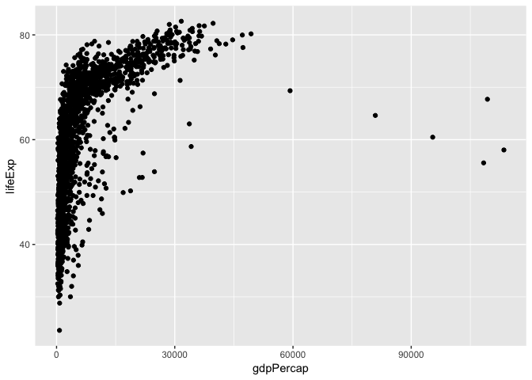<!-- -->

So the first thing we do is call the `ggplot` function. This function lets R
know that we're creating a new plot, and any of the arguments we give the
`ggplot` function are the *global* options for the plot: they apply to all
layers on the plot.

We've passed in two arguments to `ggplot`. First, we tell `ggplot` what data we
want to show on our figure, in this example the gapminder data we read in
earlier. For the second argument we passed in the `aes` function, which
tells `ggplot` how variables in the **data** map to *aesthetic* properties of
the figure, in this case the **x** and **y** locations. Here we told `ggplot` we
want to plot the "gdpPercap" column of the gapminder data frame on the x-axis, and
the "lifeExp" column on the y-axis. Notice that we didn't need to explicitly
pass `aes` these columns (e.g. `x = gapminder[, "gdpPercap"]`), this is because
`ggplot` is smart enough to know to look in the **data** for that column!

By itself, the call to `ggplot` isn't enough to draw a figure:

~~~
ggplot(data = gapminder, aes(x = gdpPercap, y = lifeExp))
~~~
{: .language-r}

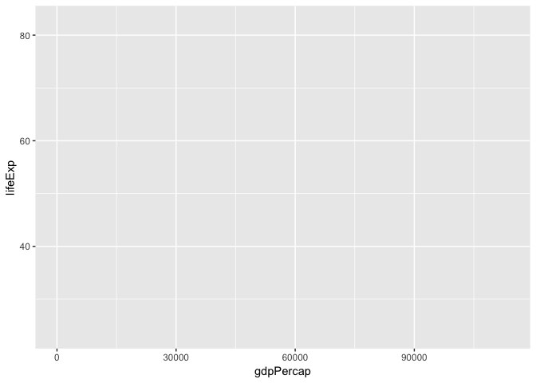<!-- -->

We need to tell `ggplot` how we want to visually represent the data, which we
do by adding a new **geom** layer. In our example, we used `geom_point`, which
tells `ggplot` we want to visually represent the relationship between **x** and
**y** as a scatter plot of points:

~~~
ggplot(data = gapminder, aes(x = gdpPercap, y = lifeExp)) +
  geom_point()+
  scale_x_log10()
~~~
{: .language-r}

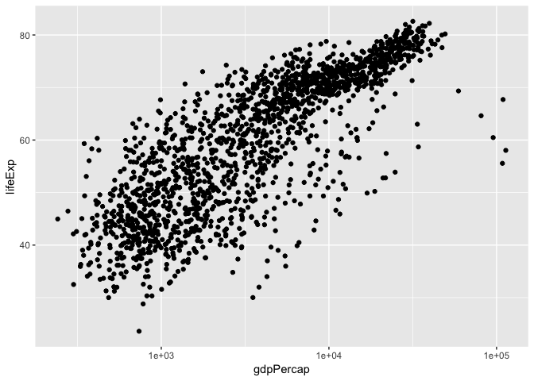<!-- -->

There are also built-in axis transformation methods, for example Log10-transformations. Unfortunately not all transformations are built in like a simple log-transformation, in which case we can do this:

~~~
ggplot(data = gapminder, aes(x = log(gdpPercap), y = lifeExp)) +
  geom_point()
~~~
{: .language-r}

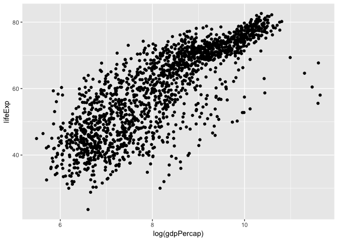<!-- -->

> ## Challenge 1
>
> Modify the example so that the figure visualise how life expectancy has
> changed over time:
>
> 
> ~~~
> ggplot(data = gapminder, aes(x = gdpPercap, y = lifeExp)) + geom_point()
> ~~~
> {: .language-r}
>
> Hint: the gapminder dataset has a column called "year", which should appear
> on the x-axis.
>
> > ## Solution to challenge 1
> >
> > Modify the example so that the figure visualise how life expectancy has
> > changed over time:
> >
> > 
> > ~~~
> > ggplot(data = gapminder, aes(x = year, y = lifeExp)) + geom_point()
> > ~~~
> > {: .language-r}
> > 
> > <!-- -->
> >
> {: .solution}
{: .challenge}

## Aesthetics 

We can also colour points based on different factors, such as by continent

~~~
ggplot(data = gapminder, aes(x = log(gdpPercap), y = lifeExp, colour = continent)) +
  geom_point()
~~~
{: .language-r}

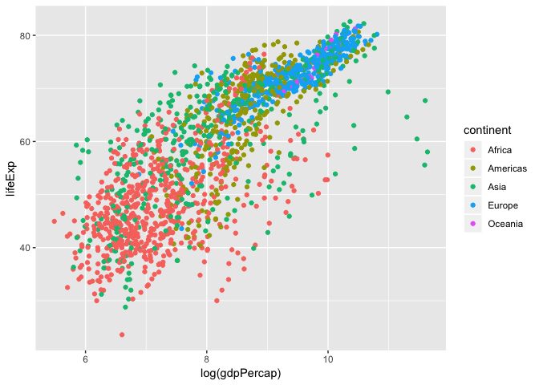<!-- -->

## Linear Regression

Let's add a linear regression line to this plot.

~~~
ggplot(data = gapminder, aes(x = log(gdpPercap), y = lifeExp, colour = continent)) +
  geom_point()+
  geom_smooth(method = "lm")
~~~
{: .language-r}

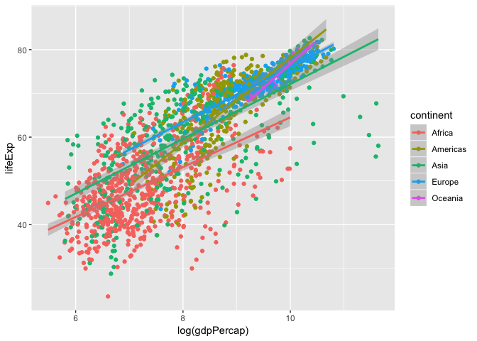<!-- -->

Here we see a linear regression line for each continent, but what is the over all global trend? Let's redraw that regression line to represent the global trend.

~~~
ggplot(data = gapminder, aes(x = log(gdpPercap), y = lifeExp)) +
  geom_point(aes(colour = continent))+
  geom_smooth(method = "lm", colour="black")
~~~
{: .language-r}

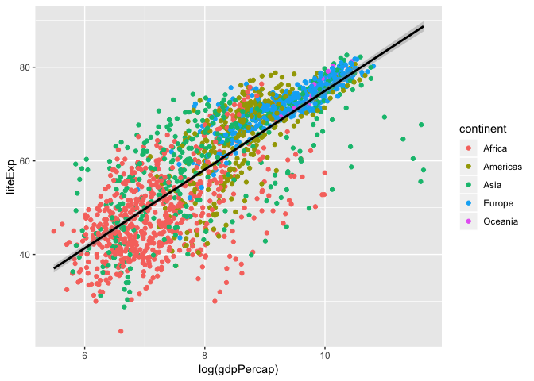<!-- -->

So, what is the actual equation of this trend line? What is the slope? correlation? p-value?
We can calculate the linear model using the `lm` function. The format is `y-axis ~ x-axis, data`, and show to show the summary of the model we use the `summary` function of the `lm` output.

~~~
fit <- lm(lifeExp ~ log(gdpPercap), data = gapminder)
summary(fit)
~~~
{: .language-r}

~~~
## 
## Call:
## lm(formula = lifeExp ~ log(gdpPercap), data = gapminder)
## 
## Residuals:
##     Min      1Q  Median      3Q     Max 
## -32.778  -4.204   1.212   4.658  19.285 
## 
## Coefficients:
##                Estimate Std. Error t value Pr(>|t|)    
## (Intercept)     -9.1009     1.2277  -7.413 1.93e-13 ***
## log(gdpPercap)   8.4051     0.1488  56.500  < 2e-16 ***
## ---
## Signif. codes:  0 '***' 0.001 '**' 0.01 '*' 0.05 '.' 0.1 ' ' 1
## 
## Residual standard error: 7.62 on 1702 degrees of freedom
## Multiple R-squared:  0.6522,	Adjusted R-squared:  0.652 
## F-statistic:  3192 on 1 and 1702 DF,  p-value: < 2.2e-16
~~~
{: .output}

Looking at the p-value, this shows that there is significant positive relationship between life expectancy and log-transformed GDP per capita.
Let's add the linear regression line equation and its significance to the plot!

To do this we need to extract this information from the `summary()`, and print out $y=a+bx$.

~~~
# Extract information to build an equation
a <- signif(fit$coefficients[[1]], 2)
b <- signif(fit$coefficients[[2]], 2)
r2 <- signif(summary(fit)$adj.r.squared,2)
pval <- signif(summary(fit)$coefficients[2,4], 2)
eq <- paste("y = ",a," + ", b, "x , r^2 = ", r2,", pval = ",pval)
eq
~~~
{: .language-r}

~~~
## [1] "y =  -9.1  +  8.4 x , r^2 =  0.65 , pval =  0"
~~~
{: .output}

~~~
# Create plot and annotate with equation
ggplot(data = gapminder, aes(x = log(gdpPercap), y = lifeExp)) +
  geom_point(aes(colour = continent))+
  geom_smooth(method = "lm", colour="black")+
  annotate("text", x=7, y=80,label = eq, colour = "black")
~~~
{: .language-r}

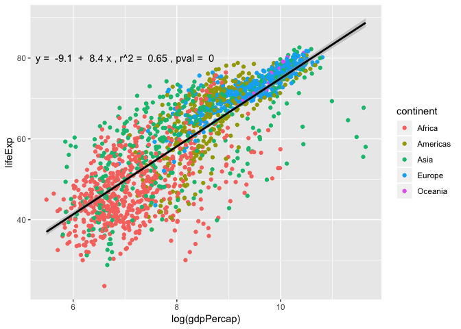<!-- -->

## Layers

Using a scatter plot probably isn't the best for visualizing change over time.
Instead, let's tell `ggplot` to visualize the data as a line plot:

~~~
ggplot(data = gapminder, aes(x=year, y=lifeExp, by=country, color=continent)) +
  geom_line()
~~~
{: .language-r}

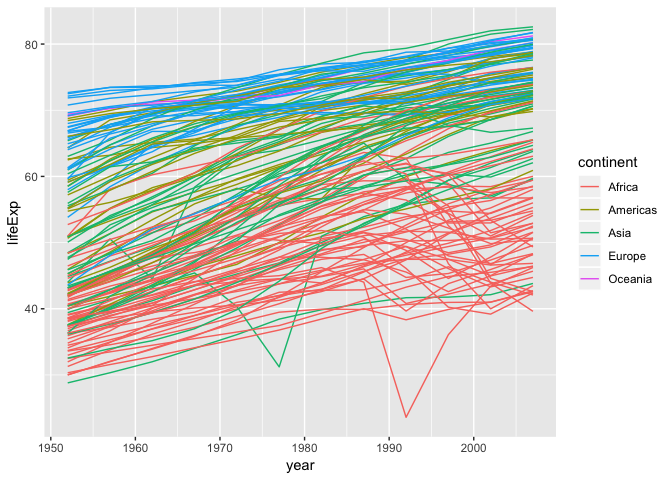<!-- -->
Instead of adding a `geom_point` layer, we've added a `geom_line` layer. We've
added the **by** *aesthetic*, which tells `ggplot` to draw a line for each
country.

We can also combine `geom_point` and `geom_line`

~~~
ggplot(data = gapminder, aes(x=year, y=lifeExp, by=country, color=continent)) +
  geom_line()+
  geom_point()
~~~
{: .language-r}

<!-- -->

We see two countries, one in Asia and one in Africa, that show a noticeable big drop in life expectancy. 
Let's try to figure out which countries and years they are:

We can set logical criteria based on what is shown in the graph the year, continent, and life expectancy.

~~~
gapminder[gapminder$year > 1975 & gapminder$continent %in% c("Asia", "Africa") & gapminder$lifeExp < 35,]
~~~
{: .language-r}

~~~
##       country continent year lifeExp     pop gdpPercap
## 222  Cambodia      Asia 1977  31.220 6978607  524.9722
## 1293   Rwanda    Africa 1992  23.599 7290203  737.0686
~~~
{: .output}

These correspond to the years when the Cambodian genocide and the Rwandan genocide occurred. 
These are ways in which visualizing plots leads to insights in the data. 

## Box plots
The most popular plot besides a scatter plot might be a bar graph, but bar graphs do not show distribution of data within a group very well... 
Instead, using box plots is a great alternative. Let's make one here:

~~~
ggplot(gapminder, aes(x= continent, y = log(gdpPercap), fill = continent))+
  geom_boxplot()
~~~
{: .language-r}

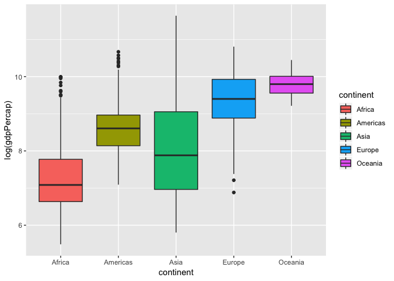<!-- -->

One common misconception is the middle bar that cuts across each group. This is the **median** of the group distribution, NOT the average. The edge of the boxes in a box plots show the quartile ranges. 

## Violin plots

A variation of a box plot is a violin plot. Violin plots show full distribution and density of data. 

~~~
ggplot(gapminder, aes(x= continent, y = log(gdpPercap), fill = continent))+
  geom_violin()
~~~
{: .language-r}

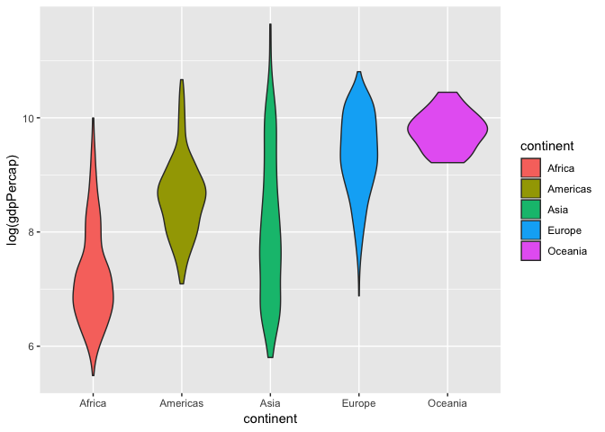<!-- -->

We can also combine this with a box plot to get quartile information and make the box plot smaller so its within the violin curves.

~~~
ggplot(gapminder, aes(x= continent, y = log(gdpPercap), fill = continent))+
  geom_violin()+
  geom_boxplot(width = 0.1)
~~~
{: .language-r}

<!-- -->

Now that we can see the distribution of log-transformed GDP per capita varies between continents, let's see if any of the continents are significantly different from another. To test this we will run an one-way Analysis of Variance (ANOVA) model as shown below. 

~~~
fit_anov <- aov(log(gdpPercap)~ continent, data = gapminder)
summary(fit)
~~~
{: .language-r}

~~~
## 
## Call:
## lm(formula = lifeExp ~ log(gdpPercap), data = gapminder)
## 
## Residuals:
##     Min      1Q  Median      3Q     Max 
## -32.778  -4.204   1.212   4.658  19.285 
## 
## Coefficients:
##                Estimate Std. Error t value Pr(>|t|)    
## (Intercept)     -9.1009     1.2277  -7.413 1.93e-13 ***
## log(gdpPercap)   8.4051     0.1488  56.500  < 2e-16 ***
## ---
## Signif. codes:  0 '***' 0.001 '**' 0.01 '*' 0.05 '.' 0.1 ' ' 1
## 
## Residual standard error: 7.62 on 1702 degrees of freedom
## Multiple R-squared:  0.6522,	Adjusted R-squared:  0.652 
## F-statistic:  3192 on 1 and 1702 DF,  p-value: < 2.2e-16
~~~
{: .output}

We have a p-value less than $2*10^-16^$ and we reject the null hypothesis. As a result we can move onto a post-hoc test to see which continents are significant from each other using `TukeyHSD` to compute the Tukey Honest Significant Differences.

~~~
TukeyHSD(fit_anov, "continent", conf.level = 0.95)
~~~
{: .language-r}

~~~
##   Tukey multiple comparisons of means
##     95% family-wise confidence level
## 
## Fit: aov(formula = log(gdpPercap) ~ continent, data = gapminder)
## 
## $continent
##                        diff        lwr        upr     p adj
## Americas-Africa   1.3669838  1.1884331  1.5455345 0.0000000
## Asia-Africa       0.8234016  0.6601195  0.9866838 0.0000000
## Europe-Africa     2.0961215  1.9279190  2.2643241 0.0000000
## Oceania-Africa    2.5299717  2.0013218  3.0586215 0.0000000
## Asia-Americas    -0.5435821 -0.7381069 -0.3490574 0.0000000
## Europe-Americas   0.7291378  0.5304649  0.9278107 0.0000000
## Oceania-Americas  1.1629879  0.6238687  1.7021070 0.0000000
## Europe-Asia       1.2727199  1.0876480  1.4577918 0.0000000
## Oceania-Asia      1.7065700  1.1723134  2.2408267 0.0000000
## Oceania-Europe    0.4338501 -0.1019308  0.9696310 0.1759429
~~~
{: .output}

## Multi-panel figures

Earlier we visualized the change in life expectancy over time across all
countries in one plot. Alternatively, we can split this out over multiple panels
by adding a layer of **facet** panels. Focusing only on those countries with
names that start with the letter "A" or "Z".

> ## Tip
>
> We start by subsetting the data.  We use the `substr` function to
> pull out a part of a character string; in this case, the letters that occur
> in positions `start` through `stop`, inclusive, of the `gapminder$country`
> vector. The operator `%in%` allows us to make multiple comparisons rather
> than write out long subsetting conditions (in this case,
> `starts.with %in% c("A", "Z")` is equivalent to
> `starts.with == "A" | starts.with == "Z"`)
{: .callout}

~~~
starts_with <- substr(gapminder$country, start = 1, stop = 1)
AZcountries <- gapminder[starts_with %in% c("A", "Z"), ]
ggplot(data = AZcountries, aes(x = year, y = lifeExp, color=continent)) +
  geom_line() + facet_wrap( ~ country)
~~~
{: .language-r}

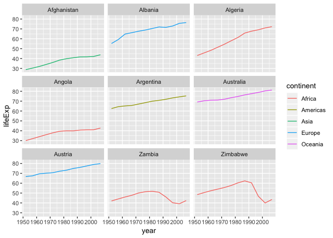<!-- -->

## Changing axis labels and adding a title

Let's create a simple scatter plot again and change the axis labels and add a title

~~~
ggplot(data = gapminder, aes(x = log(gdpPercap), y = lifeExp)) +
  geom_point()+
  labs(title = "Scatter plot of life expectancy v. GDP per capita",
      subtitle = paste(nrow(gapminder), "data points"))+
  xlab("Log-transformed GDP per capita")+
  ylab("Life expectancy")
~~~
{: .language-r}

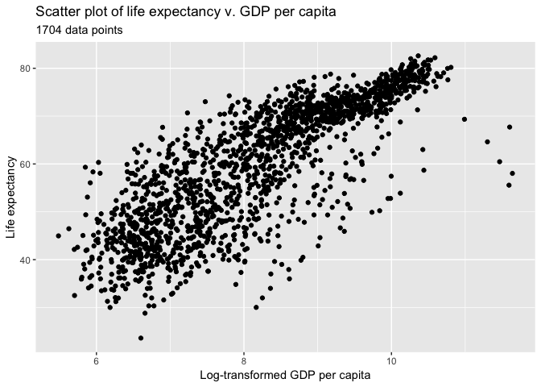<!-- -->

## Heatmap 

Ggplot is able to create heat maps, but it has major limitations... To circumvent this we will install a new package called `corrplot` using `install.packages`.

~~~
install.packages("corrplot")
~~~
{: .language-r}

Once installation is finished, lets load it into our environment. 

~~~
library(corrplot)
~~~
{: .language-r}

~~~
## corrplot 0.84 loaded
~~~
{: .output}

For this example we're going to use the `mtcars` data set that is default available on R. The data was extracted from the 1974 Motor Trend US magazine, and comprises fuel consumption and 10 aspects of automobile design and performance for 32 automobiles (1973–74 models). See `?mtcars` for more information regarding this data set.

Let's take a look at `mtcars` and calculate the Pearson correlation to use in our heat map.

~~~
# Quick look at mtcars.
head(mtcars)
~~~
{: .language-r}

~~~
##                    mpg cyl disp  hp drat    wt  qsec vs am gear carb
## Mazda RX4         21.0   6  160 110 3.90 2.620 16.46  0  1    4    4
## Mazda RX4 Wag     21.0   6  160 110 3.90 2.875 17.02  0  1    4    4
## Datsun 710        22.8   4  108  93 3.85 2.320 18.61  1  1    4    1
## Hornet 4 Drive    21.4   6  258 110 3.08 3.215 19.44  1  0    3    1
## Hornet Sportabout 18.7   8  360 175 3.15 3.440 17.02  0  0    3    2
## Valiant           18.1   6  225 105 2.76 3.460 20.22  1  0    3    1
~~~
{: .output}

~~~
# Pearson correlation is default. See ?cor for other available methods
cor_mtcars <- cor(mtcars) 
head(cor_mtcars)
~~~
{: .language-r}

~~~
##             mpg        cyl       disp         hp       drat         wt
## mpg   1.0000000 -0.8521620 -0.8475514 -0.7761684  0.6811719 -0.8676594
## cyl  -0.8521620  1.0000000  0.9020329  0.8324475 -0.6999381  0.7824958
## disp -0.8475514  0.9020329  1.0000000  0.7909486 -0.7102139  0.8879799
## hp   -0.7761684  0.8324475  0.7909486  1.0000000 -0.4487591  0.6587479
## drat  0.6811719 -0.6999381 -0.7102139 -0.4487591  1.0000000 -0.7124406
## wt   -0.8676594  0.7824958  0.8879799  0.6587479 -0.7124406  1.0000000
##             qsec         vs         am       gear       carb
## mpg   0.41868403  0.6640389  0.5998324  0.4802848 -0.5509251
## cyl  -0.59124207 -0.8108118 -0.5226070 -0.4926866  0.5269883
## disp -0.43369788 -0.7104159 -0.5912270 -0.5555692  0.3949769
## hp   -0.70822339 -0.7230967 -0.2432043 -0.1257043  0.7498125
## drat  0.09120476  0.4402785  0.7127111  0.6996101 -0.0907898
## wt   -0.17471588 -0.5549157 -0.6924953 -0.5832870  0.4276059
~~~
{: .output}

~~~
# Plot heatmap
corrplot(cor_mtcars, method = "circle")
~~~
{: .language-r}

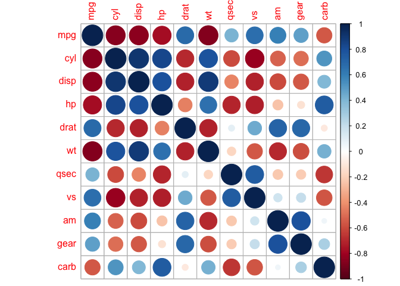<!-- -->

In this heat map both size and colour corresponds to the Pearson coefficient. There are also other methods we can explore:

~~~
corrplot(cor_mtcars, method = "square")
~~~
{: .language-r}

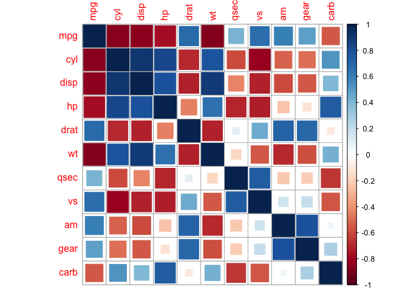<!-- -->

~~~
corrplot(cor_mtcars, method = "number")
~~~
{: .language-r}

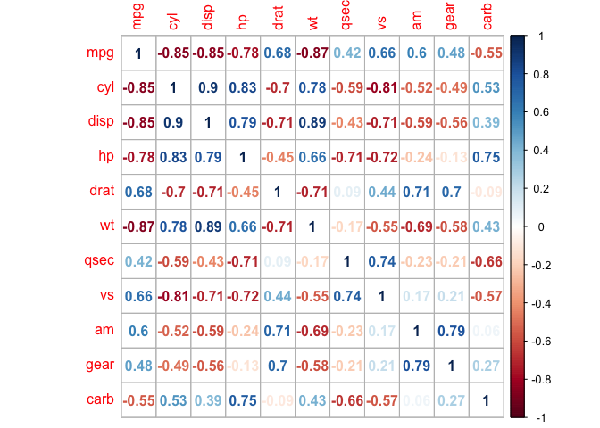<!-- -->

Heat maps are redundant, and we can eliminate this by taking a slice of the map.

~~~
corrplot(cor_mtcars, type = "upper")
~~~
{: .language-r}

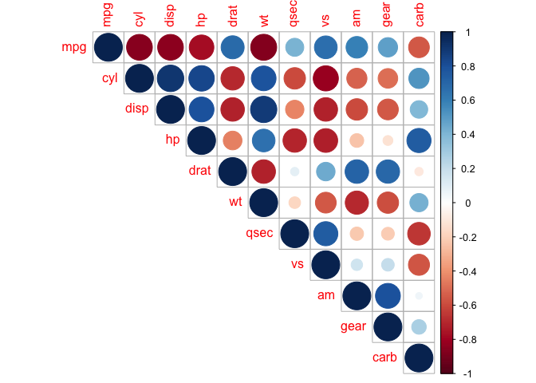<!-- -->

~~~
corrplot(cor_mtcars, type = "lower")
~~~
{: .language-r}

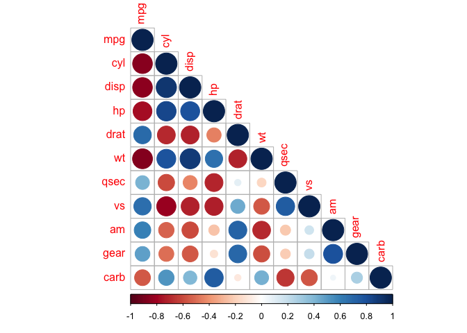<!-- -->

We can also mix together shapes and numbers (or any two combinations of methods) to increase the amount of information we can represent in a heat map.

~~~
corrplot.mixed(cor_mtcars, lower = "number", upper = "circle")
~~~
{: .language-r}

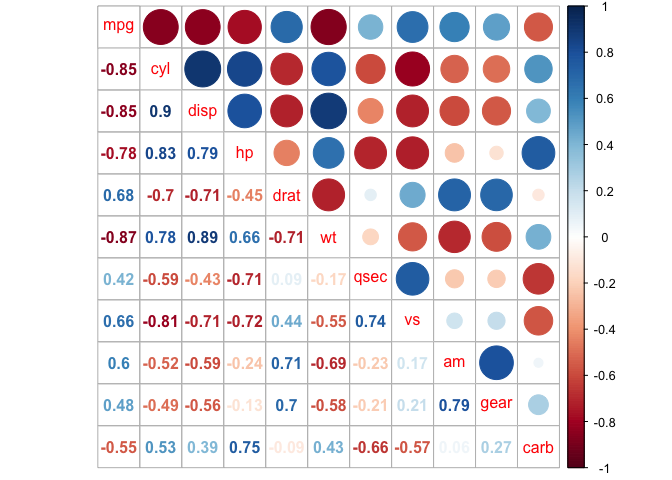<!-- -->

The correlation matrix can be reordered according to the correlation coefficient. This is important to identify the hidden structure and pattern in the matrix. There are multiple methods avaialble for clustering, but we will only use the k-means hierarchical clustering method here:

~~~
corrplot(cor_mtcars, order = "hclust")
~~~
{: .language-r}

<!-- -->

We can also direct corrplot to identify the two distinct groups we can see by eye.

~~~
corrplot(cor_mtcars, order = "hclust", addrect = 2)
~~~
{: .language-r}

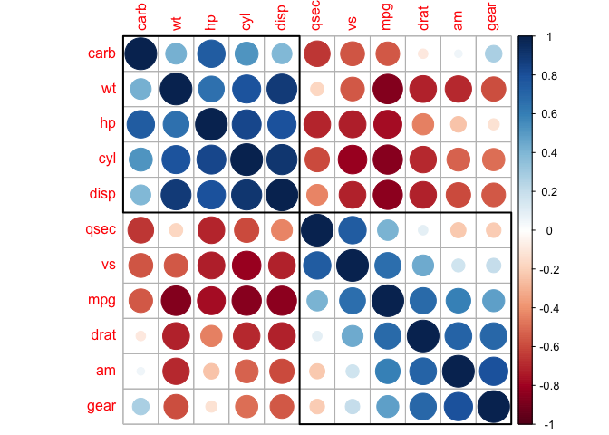<!-- -->

And also groups that might not be immediately clear to us.

~~~
corrplot(cor_mtcars, order = "hclust", addrect = 3)
~~~
{: .language-r}

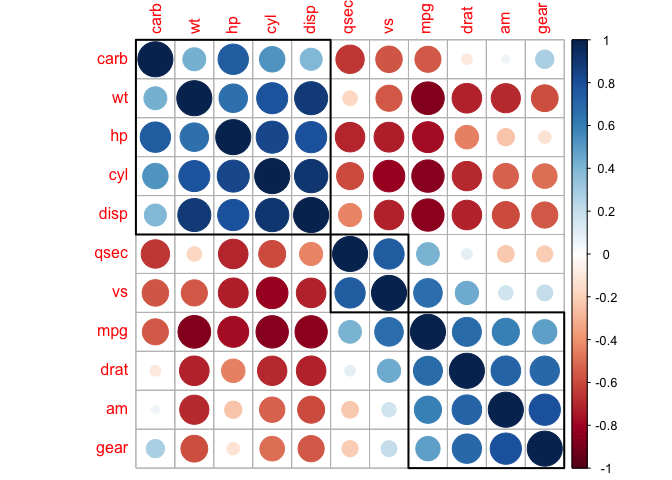<!-- -->

This is a taste of what you can do with `ggplot2` and other plotting resources. R Studio provides a
really useful [cheat sheet][cheat] of the different layers available, and more
extensive documentation is available on the [ggplot2 website][ggplot-doc].
Finally, if you have no idea how to change something, a quick Google search will
usually send you to a relevant question and answer on Stack Overflow with reusable
code to modify!
[cheat]: http://www.rstudio.com/wp-content/uploads/2015/03/ggplot2-cheatsheet.pdf
[ggplot-doc]: http://docs.ggplot2.org/current/

[sample gallery of ggplots!](http://r-statistics.co/Top50-Ggplot2-Visualizations-MasterList-R-Code.html)
