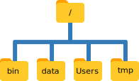

```{r, include=FALSE}
source("../bin/chunk-options.R")
opts_chunk$set(fig.path ="../fig/02-")
```

## Working Directories
The part of the operating system responsible for managing files and directories is called the file system. It organizes our data into files, which hold information, and directories (also called “folders”), which hold files or other directories.

Several commands are frequently used to create, inspect, rename, and delete files and directories. To start exploring them, we’ll go to our open shell window.

First let’s find out where we are by running a command called `getwd()` (which stands for “get working directory”). Directories are like places - at any time while we are using the shell we are in exactly one place, called our current working directory. Commands mostly read and write files in the current working directory, i.e. “here”, so knowing where you are before running a command is important. `getwd()` shows you where you are:


```{r, results ="hide"}
getwd()
```
```{r, echo=FALSE}
"/Users/nelle"
```
Here, the computer's response is `/Users/nelle`, which is Nelle's **home directory**.

> ## Home Directory Variation
>
> The home directory path will look different on different operating systems. On Linux it may look like `/home/nelle`, and on Windows it will be similar to `C:\Documents and Settings\nelle` or `C:\Users\nelle`.
> (Note that it may look slightly different for different versions of Windows.) In future examples, we’ve used Mac output as the default - Linux and Windows output may differ slightly, but should be generally similar.
>
{: .callout}

To understand what a “home directory” is, let’s have a look at how the file system as a whole is organized. For the sake of this example, we’ll be illustrating the filesystem on our scientist Nelle’s computer. After this illustration, you’ll be learning commands to explore your own filesystem, which will be constructed in a similar way, but not be exactly identical.

On Nelle’s computer, the filesystem looks like this:



At the top is the root directory that holds everything else. We refer to it using a slash character, `/`, on its own; this is the leading slash in `/Users/nelle`.

Inside that directory are several other directories: `bin` (which is where some built-in programs are stored), `data` (for miscellaneous data files), Users (where users’ personal directories are located), `tmp` (for temporary files that don’t need to be stored long-term), and so on.

We know that our current working directory `/Users/nelle` is stored inside `/Users` because `/Users` is the first part of its name. Similarly, we know that `/Users` is stored inside the root directory `/` because its name begins with `/`.

> ## Slashes
>
> Notice that there are two meanings for the `/` character. When it appears at the front of a file or directory name, it refers to the root directory. When it appears inside a name, it’s just a separator.
>
{: .callout}

Underneath `/Users`, we find one directory for each user with an account on Nelle’s machine, her colleagues the Mummy and Wolfman.


The Mummy’s files are stored in `/Users/imhotep`, Wolfman’s in `/Users/larry`, and Nelle’s in `/Users/nelle`. Because Nelle is the user in our examples here, this is why we get /Users/nelle as our home directory.
Typically, when you open a new command prompt you will be in your home directory to start.

Now let’s learn the command that will let us see the contents of our own filesystem. We can see what’s in our home directory by running `list.files()`:

```{r warning=FALSE,results="hide"}
list.files()
```
```{r echo=FALSE,warning=FALSE}
setwd("~/")
list.files()
```
`list.files()` prints the names of the files and directories in the current directory. 
(Again, your results may be slightly different depending on your operating system and how you have customized your filesystem.)


```{r warning=FALSE,results="hide"}
list.files("Desktop")
```
```{r echo=FALSE,warning=FALSE}
setwd("~/")
list.files("Desktop/ExampleDir")
```
`list.files(path)` prints the names of the files and directories at the given path. 


## Navigating directories

Let’s say we want to move to the Desktop directory. We can use the following commands to get there:
```{r warning=FALSE,results="hide",error=TRUE,message=FALSE}
setwd("~/Desktop")
list.files()
```
```{r echo=FALSE,warning=FALSE}
setwd("~/")
list.files("Desktop/ExampleDir")
```
`setwd(path)` means 'Set working directory' and the path defines where there directory will be set. In this case the Desktop directory. With `list.files` and `getwd()` we can see now that the directory has changed.

```{r warning=FALSE,results="hide",error=TRUE,message=FALSE}
setwd("..")
getwd()
```
`..` is a special directory name meaning "the directory above the current one" or the **parent directory**. Since we were in the `/Users/nelle/Desktop` directory moving to the `..` directory would move us to `/Users/nelle`.

```{r warning=FALSE,results="hide",error=TRUE,message=FALSE}
setwd(".")
getwd()
```
`.` is another special directory name meaning "the current directory". Since we are now in `/Users/nelle`, we should still be there.


## Absolute paths vs relative paths

There are two ways you can define paths to a file or a directory **absolute paths** and **relative paths**. So far wer have been using **relative paths**, when we used `list.files` or `setwd()`. 

**realtive  paths** tries to find that location from where we are, rather than from the root of the file system.

**absolute paths** are defined by including its entire path from the root directory, which is indicated by a leading slash. The leading `/` tells the computer to follow the path from the root of the file system, so it always refers to exactly one directory, no matter where we are when we run the command.

```{r warning=FALSE,results="hide",error=TRUE,message=FALSE}
list.files("Desktop")
list.files("/Users/nelle/Desktop")
```
```{r echo=FALSE,warning=FALSE}
setwd("~/")
list.files("Desktop/ExampleDir")
list.files("Desktop/ExampleDir")
```
